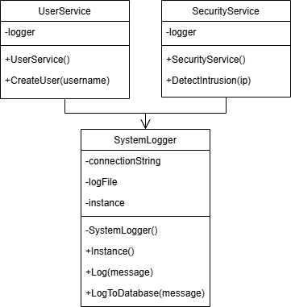

# Quels sont les problèmes potentiels liés à la création multiple d'instances de SystemLogger ?
Plusieurs instances de SystemLogger écrivent simultanément dans le même fichier, ce qui peut provoquer des problèmes de concurrence et chaque instance peut potentiellement ouvrir plusieurs connexions à la base de données.

# Comment la gestion actuelle des ressources (fichier, connexion DB) pourrait-elle poser problème ?  Que peut-il se passer si plusieurs services tentent d'écrire simultanément dans le fichier ?
Si plusieurs services écrivent simultanément dans le fichier log, cela peut conduire à des conflits d'accès ou entrelacement des logs. Le fichier ou la connexion à la base de données pourrait se retrouver dépassé, entraînant perte des logs.

# Quel design pattern permettrait de garantir une instance unique de SystemLogger ?
Le design pattern Singleton.

# Quelles sont les caractéristiques principales de ce pattern ? En quoi ce pattern résoudrait-il les problèmes identifiés ?
Le pattern Singleton assure qu'une classe n'a qu'une seule instance et fournit un point d'accès global à cette instance. Ce pattern permet de gérer des ressources partagées en centralisant leur utilisation et en évitant les conflits d'accès concurrent.

# Comment modifier la classe SystemLogger pour implémenter ce pattern ?
en ajoutant une methode Instance() et une propriété statique instance de type SystemLogger à la class SystemLogger:
```csharp
private static SystemLogger instance;

public static SystemLogger Instance()
{
    if (instance == null)
    {
        instance = new SystemLogger();
    }
    return instance;
}
```

# Creez le diagramme de classe correspondant
